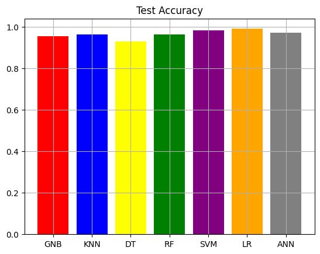

# BreastCancerDetection
Our project focuses on using machine learning classification algorithms to develop a breast cancer detection system. We gathered a diverse dataset and applied preprocessing techniques, feature selection, and various classification algorithms to train and evaluate our models. Our dataset is available through the sklearn.datasets in Python.

In this project, our main objective was to detect breast cancer using supervised machine learning algorithms. To achieve this goal, we utilized several well-known and effective algorithms in the field of machine learning. These algorithms include:

Support Vector Machine (SVM)

Logistic Regression

k-Nearest Neighbors (KNN)

Artificial Neural Networks (ANN)

Random Forest

Decision Tree

Naive Bayes

# 1. Data Preprocessing
First, we collected and cleaned the data related to patients with breast cancer. These data included various features such as tumor size, tumor shape, and other relevant characteristics. After cleaning, the data were converted into a suitable format for use in machine learning algorithms.

# 2. Model Training
Next, the data were split into training and testing sets. The training set was used to train the models, and the testing set was used to evaluate their performance. Each of the aforementioned algorithms was trained using the training data.

# 3. Model Evaluation
To evaluate the models, we used three main metrics:

Accuracy: The percentage of correct predictions made by the model out of all predictions.

Precision: The percentage of true positive predictions out of all positive predictions made.

Recall: The percentage of true positive predictions out of all actual positive cases.

Results and Comparison
Finally, the results of each algorithm were compared based on the mentioned metrics. The purpose of this comparison was to determine the efficiency of each algorithm in detecting breast cancer and to select the best model for use in real-world applications.

With this project, one can gain a better understanding of the performance of different algorithms in breast cancer detection and use optimized models to enhance the accuracy and speed of diagnosis in medical systems.

